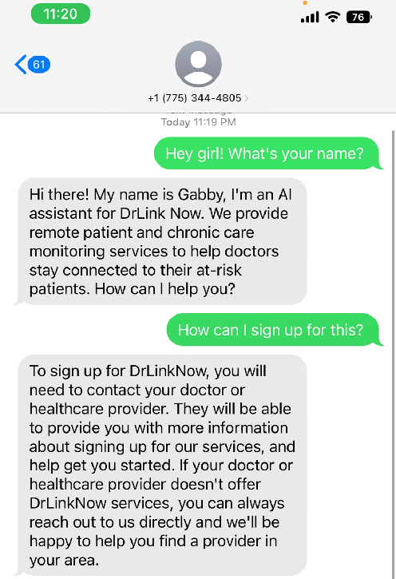

# Gabby 

## What is Gabby?

Gabby is an AI assistant that helps you with your daily tasks. 

Twilio is a cloud communications platform that enables developers to programmatically make and receive phone calls, send and receive text messages, and perform other communication functions using its web service APIs. It provides a set of APIs that developers can use to quickly add voice, messaging, and video capabilities to their applications. Twilio also provides a number of features such as caller ID, call forwarding, call masking, and voicemail. Twilio's platform is used by more than a million developers to power over 50 billion customer interactions each year. Twilio is a leading cloud communications platform used by many of the world's leading companies, including Uber, Lyft, Airbnb, and Netflix.

Render is a cloud-based platform that helps developers build and host web and mobile applications. It provides a range of services, such as serverless computing, databases, storage, and deployment, to help developers quickly create and deploy applications. Render also provides a range of tools and services, such as logging, monitoring, and analytics, to help developers manage their applications. Render is ideal for developers looking to quickly deploy their applications and scale with minimal effort. It supports a variety of programming languages and frameworks, including Node.js, Python, Ruby, and Go.

## Twilio + Render

Twilio and Render are a great combination for building and deploying web and mobile applications. Render provides a range of services, such as serverless computing, databases, storage, and deployment, to help developers quickly create and deploy applications. Twilio also provides a range of tools and services, such as logging, monitoring, and analytics, to help developers manage their applications. Render is ideal for developers looking to quickly deploy their applications and scale with minimal effort. It supports a variety of programming languages and frameworks, including Node.js, Python, Ruby, and Go.

## Gabby - AI Assistant

To use Gabby, you need to text [+1 (775) 344-4805](tel:+1775344-4805)
